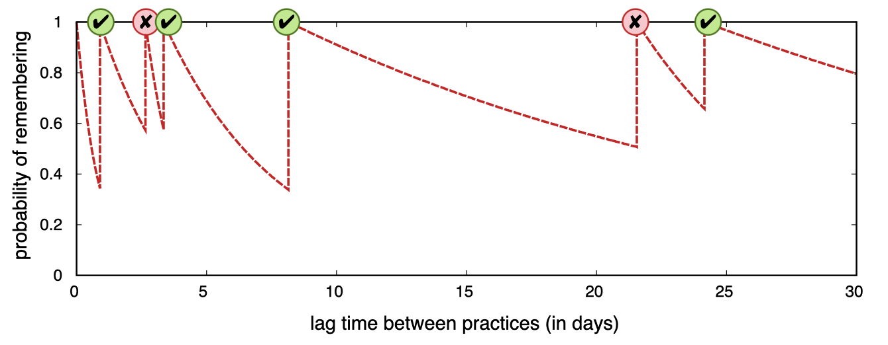
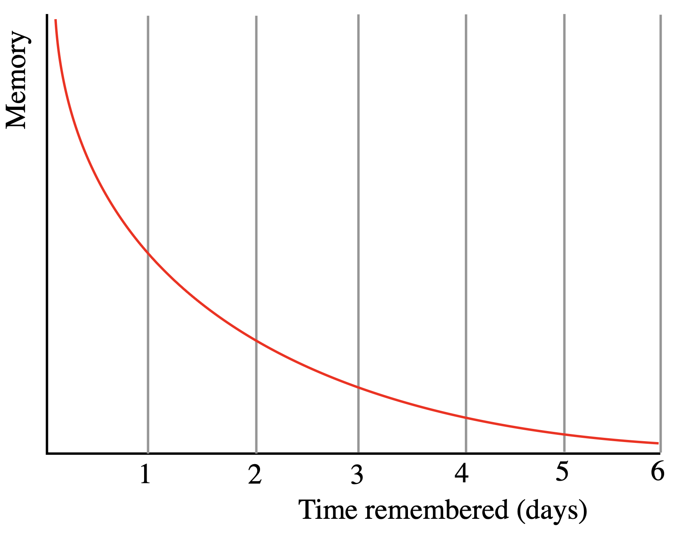
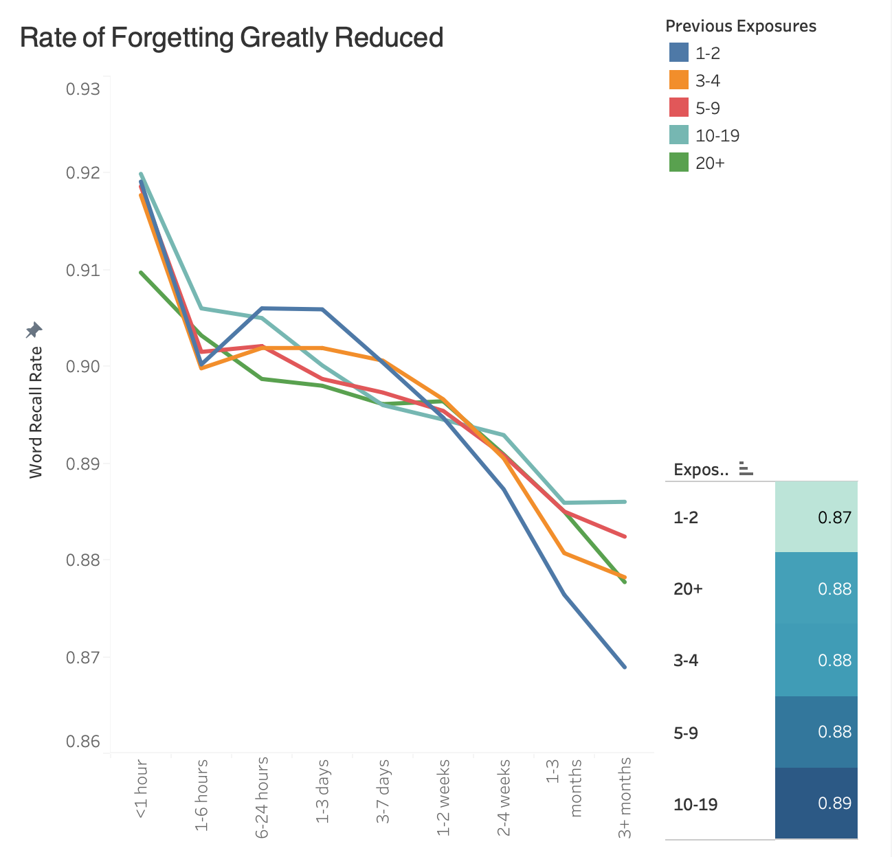
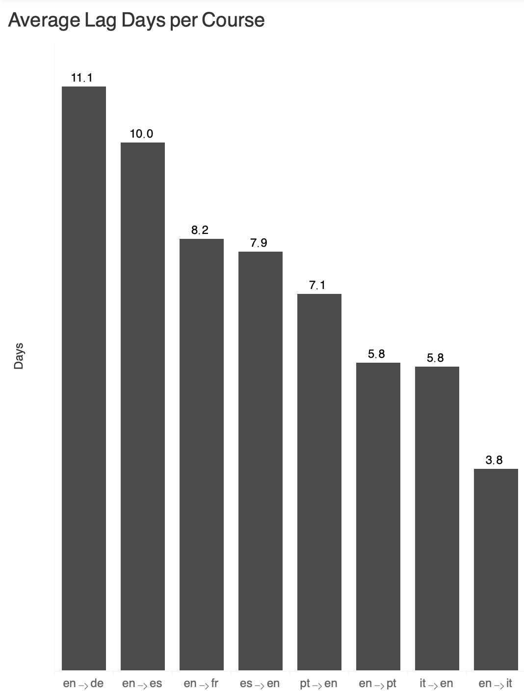

# Duolingo Vocabulary Retention Review

Duolingo is the world's most popular language learning app, with more than 50 million daily active users globally. Because the app aims to teach languages holistically, it covers all core skills — including grammar, syntax, and pronunciation. However, the most important and easiest aspect to acquire through repetition is vocabulary. For this reason, this analysis focuses on optimizing Duolingo's spaced repetition system so users can learn vocabulary as efficiently as possible.

The vocabulary retention data used in this report was gathered from over 100,000 users over 13 days in 2013, containing over 12.8 million vocabulary practice sessions across 6 languages.

To pinpoint how exactly Duolingo's current system can be improved, the following areas will be analyzed:

1. **Review spacing** — Comparing the current review system to the Ebbinghaus forgetting curve.
2. **Difficulty adjustments** — Some languages are harder to learn based on what the user's native language is. Certain specific words are very hard to learn. An ideal system should take these factors into account.
3. **Lag rates** — Assessing intervals between practice sessions, as algorithm optimizations have limited impact if user return rates are low.

## Review Spacing

Before proposing improvements to Duolingo's review system, it's worth first understanding how the current system works.

Duolingo's review scheduling is powered by an algorithm called Half-Life Regression (HLR), which dynamically spaces out word reviews based on whether a user recalled that word correctly, along with several other factors. Graph 1 illustrates this behavior.

*Graph 1: Duolingo's HLR review system — Source: [blog.duolingo.com](https://blog.duolingo.com/how-we-learn-how-you-learn/)*

For reference, if a word were learned and never reviewed again, the likelihood of recalling it would decay over time as shown below - this is the classic forgetting curve.

*Graph 2: Forgetting curve — Source: [Wikipedia](https://en.wikipedia.org/wiki/Forgetting_curve#/media/File:Forgetting_curve_decline.svg)*

Plotting Duolingo's actual review data produces the curve below:

*Graph 3: Duolingo's Review System Plotted*

Among the five exposure levels, all remain within a reasonable range of recall rate throughout the observed timeframe. All lines remain close over time until the 1-3 to 3+ month ranges, where the difference between the highest and lowest recall rates grows to a difference of 0.02. However, a ~0.868 recall rate for the lowest exposure bucket of 1-2 repetitions is still very reasonable for language comprehension, especially considering the little amount of time spent memorizing the word. Compared to the unassisted forgetting curve, this represents a substantial improvement in retention. Still, it is worth noting that more exposure does not necessarily equate to higher recall rate, as expanded on below.

## Difficulty Adjustments

The 2 hardest (lowest recall rate) words to learn per language are the following:

| Language | Word | Recall Rate (%) |
|---|---|---|
| German | zweiten, ins | 64.0, 67.4 |
| English | since, have | 50.3, 61.1 |
| Spanish | plantea, pensé | 59.8, 67.9 |
| French | en, moins | 69.9, 72.1 |
| Italian | piacere, ci | 72.7, 73.4 |
| Portuguese | Vermelhas, refeição | 72.9, 73.2 |

*Table 1: The 2 hardest words in each language*

Since a lot of these difficult words are prepositions - English "since", Spanish "del", French "en" - it could be useful to prioritize showing users more example sentences where the prepositions are used naturally. Unlike other classes of words like nouns or adjectives which usually only have 1 meaning, prepositions often have multiple different but valid uses. With more exposure to natural sentences, users get more repetition with the word in context, allowing them to understand all uses of the word.

Another thing that could boost recall rate for more difficult words is to offer the option to make mnemonics for difficult words. Duolingo could create some themselves and/or encourage users to create their own. Mnemonics are tools that aid memory; they could be an acronym, a rhyme, or a mental image. Generally things that provoke emotion are easier to remember, so the funnier or sadder the mnemonic is, the better.

## Lag Rates

*Graph 4: Average Lag Days per Course*

The average lag day rate across all recorded languages is 8.4 days. This is a number of particular concern since no amount of algorithm optimization will matter if the user doesn't put in the effort!

It is recommended that for the best vocabulary learning experience, Duolingo encourages users to use the app daily as much as possible, whether that be through push notifications, in-app incentives, or other means. Perhaps motivation could be given more to courses with the highest lag rates, such as Eng → Deutsch and less so for courses with low lag rates such as English → Italian.

---

**Tools used:** Excel, Tableau, Claude

**Data source:** [tinyurl.com/3nynbhdc](https://tinyurl.com/3nynbhdc)
